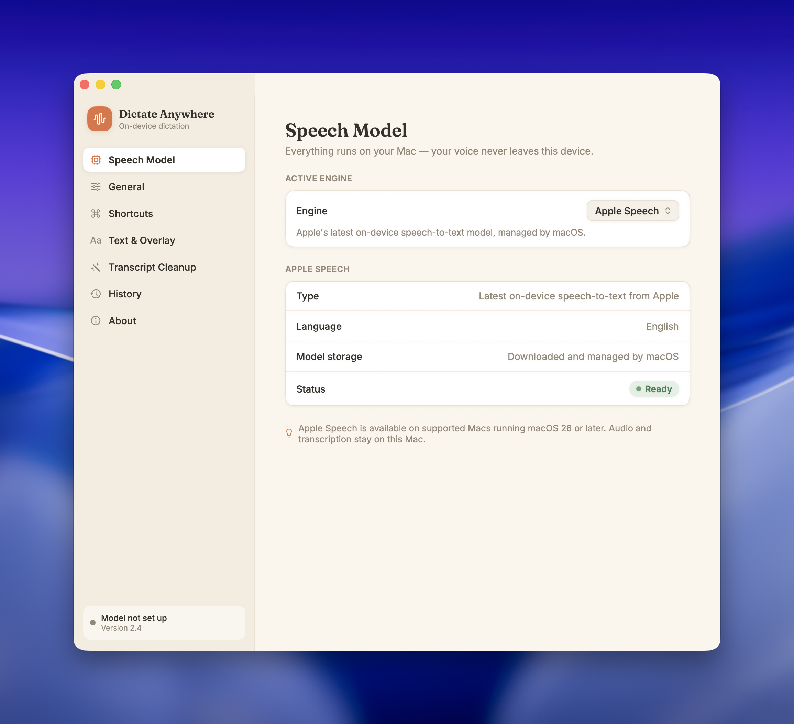
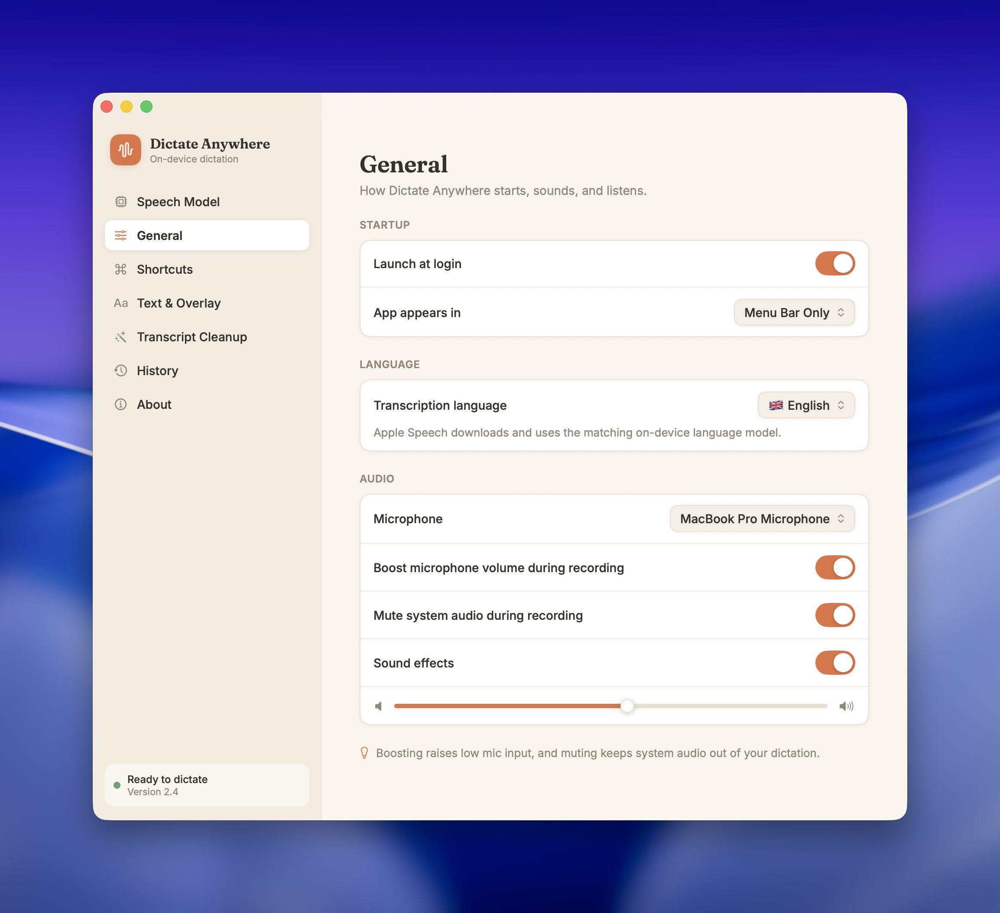
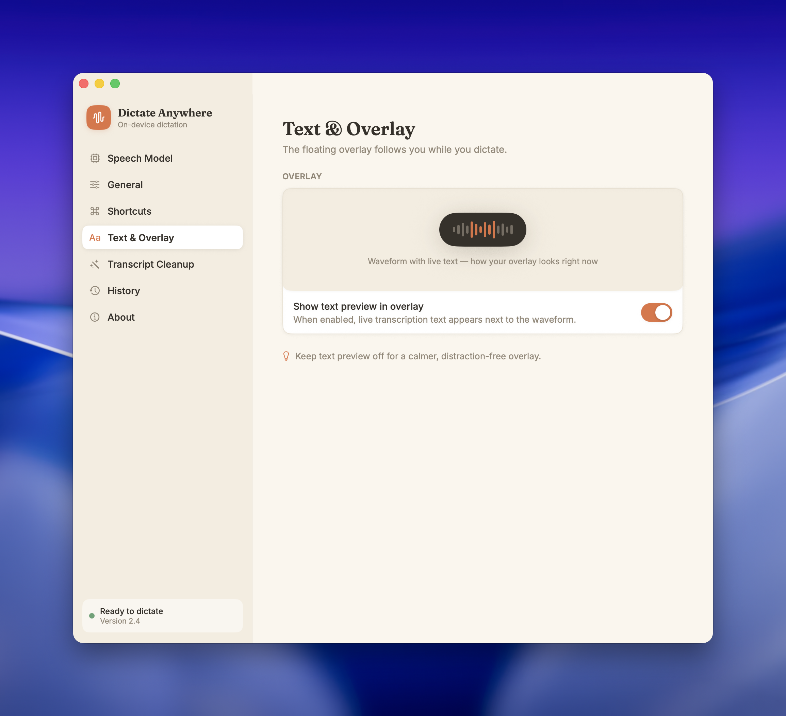
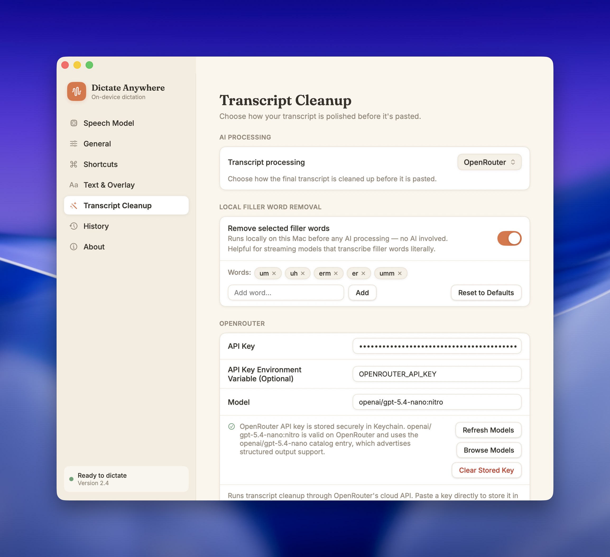

# Dictate Anywhere

A native macOS app for voice dictation anywhere. Press and hold Fn (or a custom shortcut) to dictate text directly into any app using on-device speech recognition, with optional transcript cleanup through S1-mini by Superwhisper, Apple Intelligence, Ollama, or OpenRouter.

<p align="center">
  <a href="https://github.com/hoomanaskari/mac-dictate-anywhere/releases/latest">
    
  </a>
</p>

[](https://www.apple.com/macos/)
[](https://swift.org/)
[](LICENSE)

<table>
  <tr>
    <td></td>
    <td></td>
  </tr>
  <tr>
    <td></td>
    <td></td>
  </tr>
</table>

## Features

- **Global Hotkey** - Press and hold Fn key (or custom shortcut) to dictate from anywhere
- **On-Device Processing** - All speech recognition runs locally using FluidAudio Parakeet, Nemotron, or SenseVoice models
- **26 Languages** - English, German, French, Spanish and 21 more European languages, plus Mandarin Chinese (Simplified) via the SenseVoice and Nemotron multilingual models (Nemotron multilingual requires Apple Silicon; SenseVoice also runs on Intel)
- **Hands-Free Mode** - Tap to start, tap again to stop
- **Live Preview** - See your transcription in real-time with animated waveform
- **Filler Word Removal** - Automatically removes "um", "uh", and other filler words
- **Custom Vocabulary** - Preserve product names, people names, and domain-specific terms during transcript cleanup
- **Context Awareness** - Detect the active app or supported website, read a bounded snapshot around the cursor, and apply separate styles for email, work chat, personal chat, and other apps
- **S1-mini by Superwhisper** - Download or delete a compact English transcript normalizer and run it fully on-device without a separate model server
- **Ollama Integration** - Connect to a local or remote Ollama server, refresh installed models, and manage recommended local models from the app
- **OpenRouter Integration** - Use hosted models through OpenRouter with model search, structured-output-aware selection, and secure API key storage
- **Optional Transcript Cleanup** - Post-process the final transcript with S1-mini by Superwhisper, Apple Intelligence, Ollama, or OpenRouter for punctuation, grammar, formatting, and wording cleanup
- **Safe Fallbacks** - If AI cleanup fails or returns unusable output, the original local transcript is pasted instead
- **Menu Bar App** - Runs quietly in your menu bar

## Installation

### Download

1. Download the latest notarized `.dmg` from [Releases](../../releases)
2. Open the DMG and drag **Dictate Anywhere** to your Applications folder
3. Launch the app and grant the required permissions

### Required Permissions

- **Microphone** - For capturing your voice
- **Accessibility** - For detecting the Fn key globally and inserting text

## Optional AI Transcript Cleanup

Dictate Anywhere always transcribes audio locally with FluidAudio. Cleanup happens only after transcription, so your raw audio stays on your Mac even when you enable Ollama or OpenRouter. Context Awareness keeps surrounding text local by default; sharing it with a remote cleanup provider requires a separate opt-in.

| Provider | Runs Where | Best For | Benefits |
|----------|------------|----------|----------|
| None | Nowhere | Fastest raw dictation | Uses the local FluidAudio transcript as-is |
| FluidAudio Vocabulary | On-device | Lightweight terminology correction | Applies vocabulary rescoring to Parakeet TDT final transcripts without an LLM |
| Apple Intelligence | On-device | Native macOS cleanup | On-device cleanup on supported Macs |
| S1-mini by Superwhisper | On-device | Compact English transcript normalization | One-click 462 MB download, fixed style/structure/context controls, and no separate server |
| Ollama | Local or self-hosted server | Privacy-first LLM cleanup | Local model choice, optional reasoning controls, and in-app model management for local Ollama setups |
| OpenRouter | Cloud | Broad hosted model access | Large model catalog, model search, secure key storage, and structured-output-aware selection |

### S1-mini by Superwhisper

[S1-mini by Superwhisper](https://huggingface.co/superwhisper/s1-mini) is a compact model trained specifically to normalize speech-to-text transcripts.

- Downloads a pinned Q4_K_M model directly from Hugging Face and verifies its exact size and SHA-256 before installation
- Runs through the embedded llama.cpp runtime, with Metal acceleration on Apple Silicon and CPU inference on Intel
- Provides the model's trained styling, structure, and context controls instead of an arbitrary prompt
- Supports English transcripts up to approximately 1,000 model tokens; unsupported languages or failed cleanup preserve the original transcript
- Can be removed from the Transcript Cleanup page, including its locally stored license file

### Ollama

Use Ollama when you want transcript cleanup with a local model or your own hosted Ollama server.

Recommended models:

- `gpt-oss:120b-cloud` for the best cleanup quality when you have access to a large hosted/self-hosted Ollama-backed model
- `mistral-nemo:12b` as the recommended local model when you want a much lighter on-device setup

- Runs cleanup against the configured Ollama server URL, with `http://127.0.0.1:11434` as the default local address
- Lets you enter any installed model manually or select from detected installed models
- Shows recommended models in the app, including size guidance and quality/latency tradeoffs
- Can download recommended models directly from the app when the Ollama CLI is installed and the server is local
- Can delete installed models from the app through the Ollama CLI
- Exposes reasoning controls for models that report Ollama thinking support
- Supports provider-specific cleanup prompts and shared custom vocabulary

Sample cleanup prompt for Ollama or OpenRouter:

```text
Avoid em dashes entirely.

If the speaker corrects themselves or revises what they said, preserve the final intended meaning. Replace only the portion that is clearly superseded, and leave the rest unchanged.

Add paragraph breaks and bullet points when the dictation clearly calls for structure. Otherwise, keep it as regular prose.

Convert spoken numbers to numerals when that improves clarity, while preserving intended units and symbols. Example: "thirteen point five percent" -> "13.5%".

Remove only accidental duplicate words or obvious speech-recognition repetitions. Keep intentional repetition when it appears to be deliberate.

Preserve the speaker's tone, meaning, and intent.

Treat custom vocabulary as a strong hint, not a hard rule. Use it when it clearly fits the surrounding context. If it does not, prefer the wording that best matches the sentence.
```

Benefits of using Ollama:

- Keeps transcript cleanup local when you run Ollama on your Mac
- Gives you more control over model choice, privacy, and latency than a fixed hosted provider
- Works with remote/self-hosted Ollama servers if you already have one running elsewhere
- Improves punctuation, grammar, formatting, and vocabulary normalization with stronger local models
- Custom vocabulary gives noticeably better results for names, product terms, and specialized wording when Ollama is doing post-processing

Getting started with Ollama:

1. Install [Ollama](https://ollama.com/download), or point the app at an existing Ollama server.
2. In Dictate Anywhere, open **Transcript Processing** and choose **Ollama**.
3. Confirm the server URL, then either enter a model name manually or use **Refresh Models**.
4. If you are using local Ollama with the CLI installed, download one of the suggested models directly from the app.
5. Optionally add a cleanup prompt and custom vocabulary for names, product terms, and domain-specific language.

### OpenRouter

Use OpenRouter when you want access to hosted models without managing local model downloads.

Recommended model:

- `google/gemini-3-flash-preview` for the best overall balance of cost, accuracy, and latency in Dictate Anywhere

- Supports direct OpenRouter API usage for transcript cleanup after local transcription is complete
- Lets you paste an API key into the app for secure Keychain storage
- Can also read the API key from an environment variable such as `OPENROUTER_API_KEY`
- Fetches the latest OpenRouter model catalog in-app
- Includes model search and prioritizes models that advertise structured output support
- Falls back to prompt-based JSON parsing automatically when a selected model does not support structured outputs cleanly
- Supports provider-specific cleanup prompts and shared custom vocabulary

Benefits of using OpenRouter:

- `google/gemini-3-flash-preview` currently gives the best overall results in this app when you care about cost, accuracy, and latency together
- Pairing OpenRouter with a custom cleanup prompt usually produces the best transcript quality
- Custom vocabulary gives the strongest results for names, product terms, and specialized wording when OpenRouter is doing post-processing
- Fastest way to try higher-end hosted models without running them locally
- One integration gives you access to a large cross-provider model catalog
- Model search makes it easier to find a suitable cleanup model from inside the app
- Keychain-backed API key storage keeps the common setup path simple

Getting started with OpenRouter:

1. Create an API key from [OpenRouter](https://openrouter.ai/).
2. In Dictate Anywhere, open **Transcript Processing** and choose **OpenRouter**.
3. Paste your API key, or leave the API key field empty if you launch the app with `OPENROUTER_API_KEY` set.
4. Enter a model ID manually, click **Refresh Models**, or use **Browse Models** to explore the catalog.
5. Add a custom cleanup prompt and custom vocabulary for the best results, especially for names, brands, and specialized terminology.

## Supported Languages

| Germanic | Romance | Slavic | Other | Sino-Tibetan |
|----------|---------|--------|-------|--------------|
| English | Spanish | Polish | Hungarian | Mandarin Chinese (Simplified) |
| German | French | Czech | Finnish | |
| Dutch | Italian | Slovak | Greek | |
| Swedish | Portuguese | Slovenian | Latvian | |
| Danish | Romanian | Croatian | Lithuanian | |
| Norwegian | | Bulgarian | Estonian | |
| | | Ukrainian | | |
| | | Russian | | |

## Building from Source

### Requirements

- macOS 14.0 (Sonoma) or later
- Xcode 15.0 or later
- [create-dmg](https://github.com/create-dmg/create-dmg) (optional, for creating DMG)

### Build

```bash
# Clone the repository
git clone https://github.com/hoomanaskari/mac-dictate-anywhere.git
cd mac-dictate-anywhere

# Open in Xcode
open "Dictate Anywhere.xcodeproj"

# Or build from command line
xcodebuild -project "Dictate Anywhere.xcodeproj" -scheme "Dictate Anywhere" -configuration Release build
```

If you only want to run the app locally, you do not need the release packaging script.

### Stable Local Development Workflow

For local development, use `scripts/dev.sh` with the shared **Dictate Anywhere** scheme. The workflow defaults to the **Debug** configuration, stable DerivedData, and the isolated `Dictate Anywhere Dev.app` so local permissions do not affect Release builds.

Create the ignored local signing override when needed:

```bash
scripts/dev.sh signing [TEAM_ID]
```

Automatic signing requires an Xcode account with the matching Apple Developer team and a matching development certificate. Keep `Config/Signing.local.xcconfig` ignored and do not commit it.

Common commands:

```bash
scripts/dev.sh check
scripts/dev.sh build
scripts/dev.sh build --configuration Release
scripts/dev.sh build --release
scripts/dev.sh launch
scripts/dev.sh test
scripts/dev.sh stop
```

Use `--configuration Debug` or `--configuration Release` with `build`. Tests run only with `Debug` because Release is not testable. The default is `Debug`, and `--release` is an alias for `--configuration Release`. Provisioning updates are disabled by default; pass `--allow-provisioning-updates` when you explicitly want Xcode to update signing assets. Release builds use the production signing identity and team. They do not package, notarize, update the appcast, or change production Release settings.

Set the optional `DERIVED_DATA_PATH` environment variable to use another stable path. The default is `$HOME/Library/Developer/Xcode/DerivedData/DictateAnywhereDev`.

If Accessibility permission is stale, remove `Dictate Anywhere Dev.app` from **System Settings → Privacy & Security → Accessibility**, launch it again, and add that exact app.

Release signing remains separate from this local workflow.

### Create DMG (optional)

```bash
create-dmg \
  --volname "Dictate Anywhere" \
  --window-pos 200 120 \
  --window-size 600 400 \
  --icon-size 100 \
  --icon "Dictate Anywhere.app" 150 185 \
  --app-drop-link 450 185 \
  "dist/Dictate Anywhere.dmg" \
  "dist"
```

### Signed Release Packaging

The maintainer release script is intentionally not tracked. Create your own local copy like this:

```bash
cp scripts/release-macos.template.sh scripts/release-macos.sh
chmod +x scripts/release-macos.sh
```

Then edit `scripts/release-macos.sh` and set your own values for:

- `NOTARY_PROFILE`
- `TEAM_ID`
- `DEVELOPER_ID_APP`
- `DOWNLOAD_URL_PREFIX`
- `REPOSITORY_LINK`

Also create `Config/Signing.local.xcconfig` with your own Apple Developer team ID, and update the Xcode signing settings and bundle identifiers if your local release setup needs different values.

When your local signing setup is ready, package the release with:

```bash
./scripts/release-macos.sh
```

## How It Works

1. **Activation** - Press and hold Fn key, or tap a hands-free shortcut
2. **Recording** - Speak naturally while dictation is active
3. **Processing** - Release the key, tap again, or let Parakeet EOU auto-stop when enabled
4. **Context** - When enabled, a bounded Accessibility snapshot classifies the destination and supplies local recognition hints
5. **Optional Cleanup** - The final transcript can be cleaned up with S1-mini by Superwhisper, Apple Intelligence, Ollama, or OpenRouter
6. **Insertion** - Text is automatically inserted with cursor-aware spacing; the insertion layer never adds terminal punctuation

The app uses FluidAudio speech models that run entirely on your Mac. Parakeet TDT remains the default path, and optional Parakeet EOU or Nemotron streaming models can be downloaded for lower-latency live previews.

## Privacy

- **100% On-Device Speech Recognition** - All audio transcription happens locally on your Mac
- **Context Stays Local by Default** - Surrounding text is used by on-device/local processing but is withheld from remote servers unless you explicitly enable remote context sharing
- **S1-mini Stays Fully Local** - After its one-time model download, S1-mini by Superwhisper receives transcript text only in local memory and does not require a model server
- **Ollama Can Stay Fully Local** - If you use a local Ollama server, transcript cleanup and surrounding context can stay on your machine; a remote Ollama server receives the transcript plus category/style, and receives surrounding text only with the separate opt-in
- **Optional Cloud Transcript Cleanup** - Audio never leaves your Mac; transcript text and category/style can be sent to OpenRouter when enabled, while surrounding text remains separately opt-in
- **Secure OpenRouter Key Storage** - API keys pasted into the app are stored in Keychain
- **No Analytics** - No tracking or telemetry (optional anonymous usage stats only)
- **Clipboard Only** - Text insertion uses the clipboard + Cmd+V simulation

## Contributing

Contributions are welcome! Please feel free to submit a Pull Request.

1. Fork the repository
2. Create your feature branch (`git checkout -b feature/amazing-feature`)
3. Commit your changes (`git commit -m 'Add amazing feature'`)
4. Push to the branch (`git push origin feature/amazing-feature`)
5. Open a Pull Request

## License

This project is licensed under the MIT License - see the [LICENSE](LICENSE) file for details.

## Acknowledgments

- [FluidAudio](https://github.com/FluidInference/FluidAudio) - For local Parakeet and Nemotron speech-to-text models
- [S1-mini by Superwhisper](https://huggingface.co/superwhisper/s1-mini) - For compact local English transcript normalization
- [llama.cpp](https://github.com/ggml-org/llama.cpp) and [llama.swift](https://github.com/mattt/llama.swift) - For embedded local S1-mini inference
- [Ollama](https://ollama.com/) - For enabling optional local LLM-based transcript cleanup
- [create-dmg](https://github.com/create-dmg/create-dmg) - For the DMG creation tool
